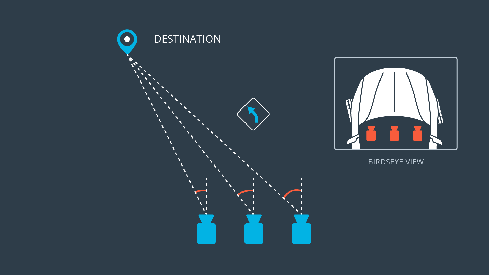

### Behavioral cloning for autonomous driving using deep ConvNets
Using a single camera input, ConvNets autonomously drive a vehicle, by controlling steering and velocity.

#### Noteworthy files:
* Project report: more details are found in `Behavioral Cloning - Project Report.ipynb`
* Training harness: `BasicRegressionModelTraining.ipynb` trains both NNs used in this project
* `drive.py` implements lateral NN controller
* `drive_LLCtrl.py` implements lateral & longitudinal controllers

#### Simulator links

* [Linux](https://d17h27t6h515a5.cloudfront.net/topher/2017/February/58ae46bb_linux-sim/linux-sim.zip)
* [Windows](https://d17h27t6h515a5.cloudfront.net/topher/2017/February/58ae4419_windows-sim/windows-sim.zip)
* [MacOS](https://d17h27t6h515a5.cloudfront.net/topher/2017/February/58ae4594_mac-sim.app/mac-sim.app.zip)

---

### Running simulation:
1 - Fire up the simulator

Two control configurations were developed

2a) Opt1: Lateral Control (NN controls steering angle only + steering modulated constant set speed)

From the command line:

`python drive.py model/model_angle.h5`


2b) Opt 2: Lateral and Longitudinal Control (NN steering angle + NN set speed)

From the command line:

`python drive_LLCtrl.py model/model_angle.h5 model/model_velocity.h5`

---

### Process:
* Collect continuous driving data
* Using Keras design and implement ConvNet  to control driving simulation
* Evaluate performance

---
### Driving environment

Two tracks were presented. 
* Easy: flat surface, wide lanes, longer straight streteches, fewer sharp turns, more wide turns


* Hard: mountainous, narrow lanes, few straight stretches, many sharp turns


---

### Data description
For steering angle, normal driving generates a very imbalanced set, with the data being dominated by the 0-angle steering (straight driving). For example:


For the speed, the two tracks differ significantly. The speed profile reflects both restrictions of the road (turns, etc) and also human driver's driving preferences.

For the easy track, I drove at maximum speed (30 mph) most of the time:


However, for the hard track, driving pattern was much more careful:


---

### Data imbalance, agumentations, and knowledge injection

#### Emulate lane drifts and correct (augmentation, knowledge injection)
Augment the set using the feed from left / right mounted cameras. Introduce *artificial* corrective steering angle.
Two corrective actions were used: 

(i) steering angle correction of `+/- 0.2` from the current shift (from a left cam shift, `+0.2`, for right cam shift, `-0.2`, where (`+`) sign is counter-clockwise direction). 



(ii) `5mph`  speed slow down, with the assumption, that if a lane drift has been encountered, we would want the vehicle to slow down. 


#### Horizontal random shifts (augmentation, knowledge injection)
During training, random horizontal shifts are applied to imag as a portion `0 < p < 1` of its width, where the applied `p~ = [-p, p]`
Same portion is applied to the steering angular shift as: 

`new angle = actual angle + (p~) x actual angle`

#### Capture more under-represented samples (data collection)
Concentrate on capturing more data for scenarios which are not encountered during driving.

#### Drive in the oposite direction
Reduces the bias of driving in a particular direction (increases variance in data, helps the NN generalize better)

#### Image LR flip
Introduce opposite driving by flipping the image and switching the sign of the angle of steering. This doesn't effect speed labels.

#### Balance scenario specific representation
Maintain an "equally" represented number of samples for corner-driving and center-driving (as much as possible)

#### Leverage bias-variance tradeoff
Favor variance in the bias-variance tradeoff. No Lx-regularization was implemented, very low dropout (0.2) for a relatively large NN. Overfitting (i.e. high variance) was minimized with early termination. Note, that without *any* dropout, validation performance suffered.

---

### Control configurations
Two types of controls have been evaluated:

#### Lateral control
Neural net controls steering angle, while constant set desired speed is modulated according to steering angle.


If the vehicle turns hard, we would like to slow down enough to take the turn. Several values for `alpha` were tried. It seems that the value of `0.2` performs satisfactorily. 
Implementation: ```drive.py ```, lines *66-70*.

#### Lateral and longitudinal control
Two deep networks control steering and vehicle set speed, respectively.


The speed output of the longitudinal network is clipped in the range `[5mph, 20 mph]`. A speed below `5mph` would stall the vehicle in the simulator. A speed above `20mph` causes severe center-seeking driving behavior in straight segments.

Implementation: ```drive_LLCtrl.py```, lines *66-72*

---

### Network architecture
Codenamed GTRegression

#### Image pre-processing

Images were cropped 50 pixels from the top, and 20 pixels from the bottom, to remove information that doesn't carry any road information (and also speeds up processing). Moreover, images were mean normalized before being fed into the net.


* Initially a quick drop of image size was desired.
* To capture the close correlation, *while* reducing the size as quick as possible, a "large" kernel size (5x5 for the first conv layer) was used, but with a stride of 2 so that local correlation information is retained as much as possible.
* The intermediary layers were selected such that there was a continuous drop in spatial size and an increase in network depth.
* Used spatial dropouts to promote robustness into the extracted feature maps (as opposed to regular random dropout which would yield a reduced learning rate [[link]](https://arxiv.org/pdf/1411.4280.pdf). Spatial dropout causes entire feature maps to be randomly dropped during training, thus forcing other feature maps to be more robust.
* Global average pooling was used before the fully connected layers. Using dropout as a model of creating multiple deep nets, average pooling takes the votes of those nets which specialized in learning more about particular abstractions, as represented by individual feature maps of the last conv layer output. Moreover, if we assume that such underlying factors have been able to fully linearize (disentangle) the latent factors, we can piece-wise approximate the left over non-linearities by a linear combination of these latent representations.
* For the longitudinal controller a relu layer should be used to avoid negative speeds. This however should not happen, as the training set of speeds has only non-negative values. For simplicity, reuse relu accross both controller architectures
* Fully connected layer (128) was used to approximate any non-linearities that were not captured from the earlier layers.
* Fully connected layer (1) which is the measure output (logit).

---

### Simulation videos

* Lateral control (Easy Track): "simu_vids_lat_ctrl/BothTrack_Trained/EasyTrack/simu_images.mp4"
* Lateral control (Hard Track): "simu_vids_lat_ctrl/BothTrack_Trained/HardTrack/simu_images.mp4"
* Lateral & Longitudinal control (Easy Track): "simu_vids_lat_long_ctrl/Easy_Track/simu_drive_cam.mp4"
* Lateral & Longitudinal control (Hard Track): "simu_vids_lat_long_ctrl/Hard_Track/simu_drive_cam.mp4"
